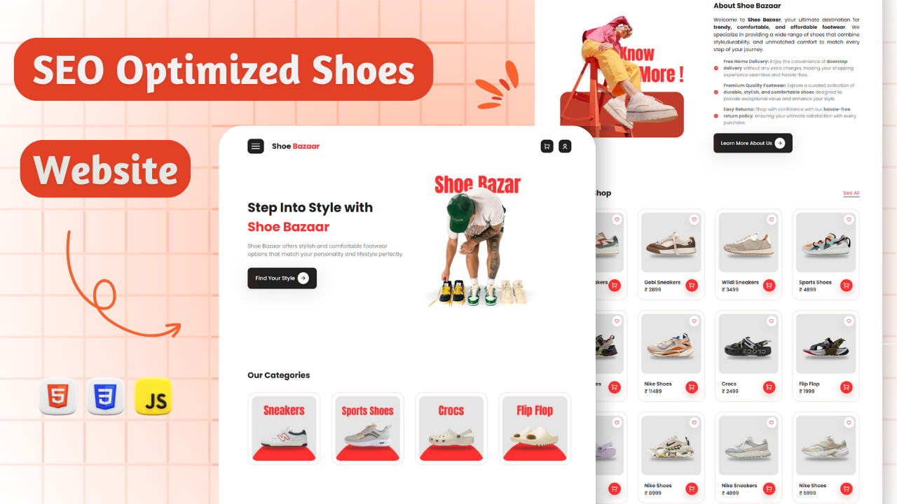

<div align="center">
  


[](https://twitter.com/intent/follow?screen_name=withaarzoo)
[](https://youtu.be/KXymZtuRRyk)

  <br />
  <br />

  <h2 align="center">Multipage E-Commerce Website – Shoe Bazaar</h2>

Welcome to the **Shoe Bazaar** project! This repository contains the source code for a fully responsive, SEO-optimized, multi-page **shoe e-commerce website** built using **HTML, CSS, and JavaScript**. The website includes essential pages like **Homepage, About Us, Products, and Contact Us**, designed to offer an engaging and seamless shopping experience.

  <div>
    <a href="https://youtu.be/DjJTXXKETiE?si=fMJJDU_vfIv0QwdL"><strong>➥ Watch Tutorial</strong></a>
    <br>
    <br>
    <a href="tel:+917586073575"><strong>➥ Download Full Source Code : +91 7586073575 (WhatsApp)</strong></a>
  </div>

</div>

---

## 🚀 Getting Started

To get started with the **Shoe Bazaar** website, follow these steps:

1. Clone the repository:

```bash
git clone https://github.com/withaarzoo/Multi-Page-Shoes-Website---ShoeBazaar.git
```

2. Open the project in your favorite **code editor**.

3. Customize the pages (index, about, products, and contact) to align with your **brand and shoe collections**.

---

## 📂 Project Structure

This multi-page e-commerce website includes the following key pages:

- **🏠 Homepage (index.html):** Features the main sections of the website, trending footwear, and special offers.
- **ℹ️ About Us (about.html):** Shares the brand story, mission, and values.
- **👞 Products (products.html):** Displays the range of shoes available, including images, descriptions, and prices.
- **📞 Contact Us (contact.html):** A form for visitors to get in touch, along with business contact details.

---

## 🔗 Essential Links

- **Remix Icon**: [Visit Site](https://ionic.io/ionicons)
- **Google Fonts**: [Visit Site](https://fonts.google.com/)
- **Email JS**: [Visit Site](https://www.emailjs.com/)

---

## 📥 Source Code

For full access to the source code, connect via **Telegram**:

📩 **+91 7586073575 (Telegram)**

---

## 🎥 Video Tutorial

Need help setting up your **Shoe Bazaar** website? Watch our detailed tutorial:

📌 [SEO Optimized Multipage Shoe E-Commerce Website Tutorial](https://youtu.be/DjJTXXKETiE?si=fMJJDU_vfIv0QwdL)

---

## 🤝 Connect with Me

For collaborations or queries, reach out via **[Bento](https://bento.me/withaarzoo).**

---

## 🖼️ Thumbnail

